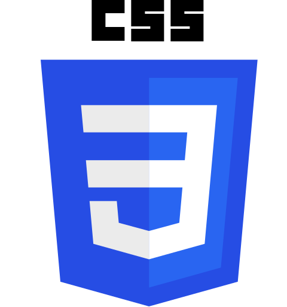

<header>
<h1>Hi 👋, I'm Houssem Eddine Chibouni</h1>
<h6>A Passionate a  Developer in Tunisia</h6>
</header>

<h2>Get in touch</h2>

<h2> Technologies That I know and use</h2>
<h3>Programming Languages</h3>

<h3>Web Development Technologies</h3>

<h3>Databases</h3>

<h3>Devops</h3>

<h3> Softaware & IDEs</h3>

<!-- <h3>Others:</h3>

 -->

